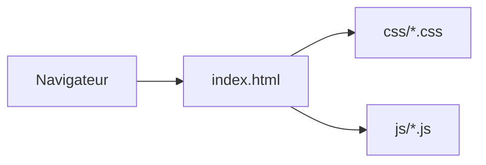

# Architecture — portfolio (site statique)

## Objectif

Site vitrine **HTML/CSS/JS** sans framework : Bootstrap, polices, scripts légers (jQuery, animations).

## Structure

| Zone | Rôle |
|------|------|
| `index.html` | Page principale et structure des sections |
| `css/` | CSS compilé (et sous-dossiers Bootstrap) |
| `scss/` | Sources SCSS (si vous regénérez le CSS) |
| `js/` | Comportements (navigation, carousels, etc.) |
| `fonts/` | Icônes et polices |

## Flux

## Pas de backend

- Aucune API serveur dans ce dépôt : déploiement sur **hébergement statique** (GitHub Pages, S3, Nginx, etc.).

## Maintenance

- Préférer modifier les **SCSS** puis recompiler si vous maintenez une chaîne Sass ; sinon éditer directement `css/` pour des changements ponctuels.
